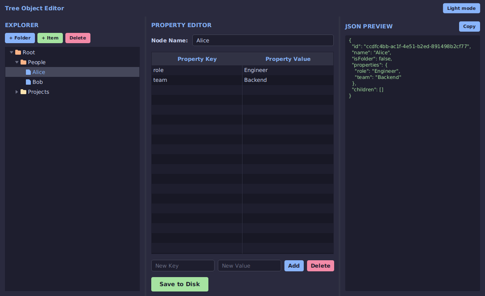
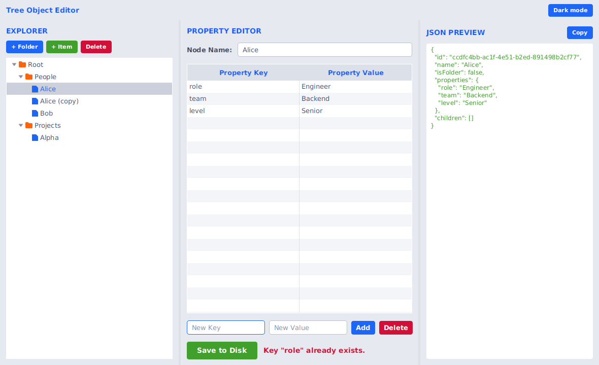

# CSC360 Group 7: Tree Object Editor


> **Course:** AU CSC360, Computer Graphics & Image Processing
> **Team:** Group 7
> **Task:** Write a JavaFX program with a tree of objects, with support for editing each object.

---

## Overview

The Tree Object Editor is a JavaFX desktop app for working with a tree of objects. Each object is either a **folder** (it can hold other objects) or an **item** (it can't). Every object has a name and any number of key/value properties, and you edit all of it from the screen. Your changes are saved to your computer automatically.

The window has three panels:

| Panel | What it does |
| :--- | :--- |
| **Explorer** (left) | Shows the tree. Add, rename, duplicate, delete, and drag nodes around. |
| **Property Editor** (middle) | Edit the selected node's name and its key/value properties. |
| **JSON Preview** (right) | Shows the selected node and everything under it as JSON. Has a **Copy** button. |

## Screenshots

| Dark | Light |
| :--: | :--: |
|  |  |

---

## Features

- **Drag and drop:** Drag a node onto a folder to move it inside. Drop it on the top or bottom edge of a row to put it in that position. Drops that would break the tree are blocked: you can't move the root, drop a folder into itself or one of its own children, or drop something inside an item.
- **Right-click menu:** New Folder, New Item, Rename, Duplicate, Delete, Expand All and Collapse All.
- **Light and dark theme:** Switch with the button in the top right, or press `Ctrl+T`. The app remembers your choice.
- **Live editing:** Name and property changes go straight into the node as you type, so switching to another node never loses your work.
- **Safe deleting:** Deleting asks for confirmation and tells you how many nodes inside it will go too.
- **Automatic saving:** Every change is written to disk. The **Save to Disk** button saves on demand and shows a message if the save fails.
- **Input checks:** Duplicate property keys and blank names are rejected.
- **Keyboard shortcuts:** `F2` rename, `Delete` delete, `Ctrl+T` switch theme.

---

## Getting Started

### What you need

- **JDK 17 or newer** (check with `java -version`)
- **Apache Maven 3.6 or newer** (check with `mvn -version`)

### Run it

```bash
git clone https://github.com/YugBangoriya/CSC360-Group7.git
cd CSC360-Group7
mvn clean javafx:run
```

The first run downloads JavaFX, so it needs an internet connection and may take a minute.

### Run it in VS Code

1. Install the **Extension Pack for Java**.
2. Open the project folder and wait for Java to finish loading.
3. Open the terminal (`` Ctrl+` ``) and run `mvn clean javafx:run`.

Running the main class with the green Run button can fail with *"JavaFX runtime components are missing"*. Use the Maven command above instead.

---

## How to Use It

**Add nodes**
1. Select a folder in the Explorer, or select an item to add next to it.
2. Click **+ Folder** or **+ Item** (or right-click and choose **New Folder** / **New Item**).
3. Type a name and press OK.

**Edit a node**
1. Click the node in the Explorer.
2. Change the name in **Node Name**.
3. To add a property, type a key and value at the bottom and click **Add** (or press `Enter`).
4. To change a property, double-click its key or value in the table, type, and press `Enter`.
5. To remove a property, select its row and click **Delete** in the Property Editor.

**Move nodes**
- Drag a node onto a folder to put it inside.
- Drag it to the top or bottom edge of a row to put it just above or below that row.

**Other**
- **Rename:** select a node and press `F2`, or use the right-click menu.
- **Duplicate:** right-click a node and choose **Duplicate**. The copy is named "... (copy)" and gets its own properties and children.
- **Delete a node:** select it and press `Delete`, or click **Delete** in the Explorer.
- **Copy the JSON:** click **Copy** above the JSON Preview.

Your data is stored in a file called `tree_data.ser` in your home folder. Delete that file if you want to start again from the default tree.

---

## Project Structure

The project follows a Model-View-Controller layout.

```text
CSC360-Group7/
├── pom.xml
├── README.md
├── docs/screenshots/                   # UI screenshots (dark and light)
└── src/main/
    ├── java/com/treeapp/
    │   ├── Main.java                   # Launcher (avoids the JavaFX module-path error)
    │   ├── App.java                    # Window, top bar and theme button
    │   ├── controller/
    │   │   └── MainController.java     # Connects the panels to the data; every change to the tree happens here
    │   ├── model/
    │   │   ├── TreeNode.java           # One node: id, name, folder flag, children, properties
    │   │   └── PropertyEntry.java      # One row of the property table
    │   ├── view/
    │   │   ├── ExplorerPanel.java      # Tree, toolbar, right-click menu, drag and drop
    │   │   ├── PropertyEditorPanel.java
    │   │   └── JsonPreviewPanel.java
    │   └── util/
    │       ├── PersistenceUtil.java    # Saves and loads ~/tree_data.ser
    │       ├── JsonFormatter.java      # Turns a node into JSON text
    │       └── ThemeManager.java       # Switches and remembers the theme
    └── resources/styles/
        ├── dark-theme.css
        └── light-theme.css
```

### How the pieces fit together

- **Model** (`TreeNode`) holds the data and knows nothing about the screen.
- **Views** (`ExplorerPanel`, `PropertyEditorPanel`, `JsonPreviewPanel`) draw the screen and report what the user did.
- **Controller** (`MainController`) receives those reports and updates the model, then refreshes the screen and saves.
- **Styling** lives in the two CSS files. Both use the same class names, so switching theme only swaps the stylesheet.

---

## Built With

- Java 17
- JavaFX 21 (`javafx-controls`)
- Apache Maven, with `javafx-maven-plugin` 0.0.8
- Plain CSS for the light and dark themes

---

## Known Limitations

- Data is saved with Java serialization, so `tree_data.ser` is not human-readable and may not open if the `TreeNode` class changes in a future version.
- There is no undo or redo yet.
- Drag and drop works inside the tree only; you can't drag between panels.
