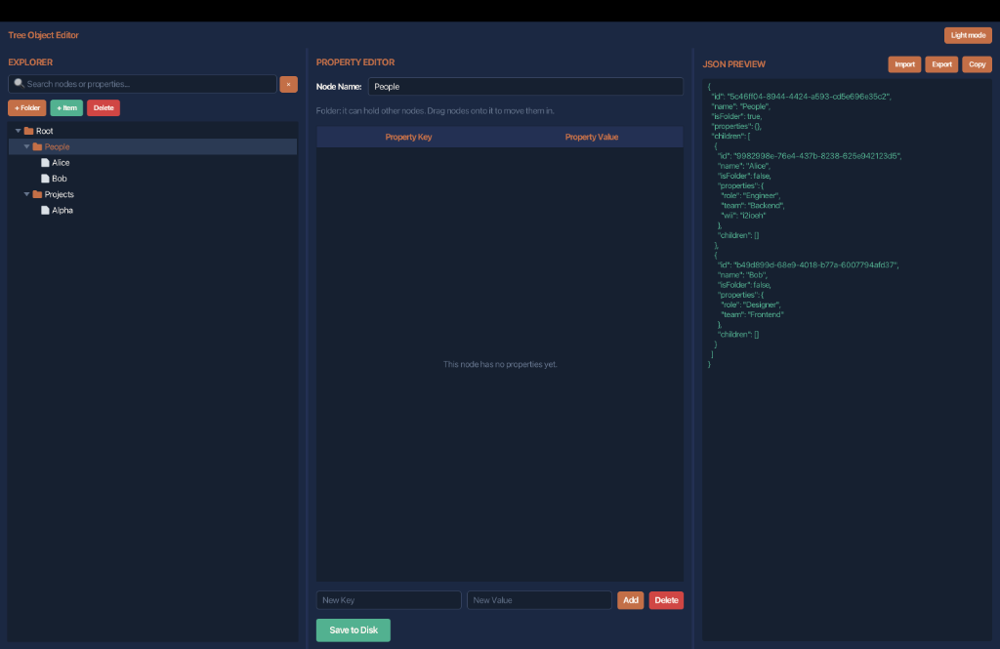
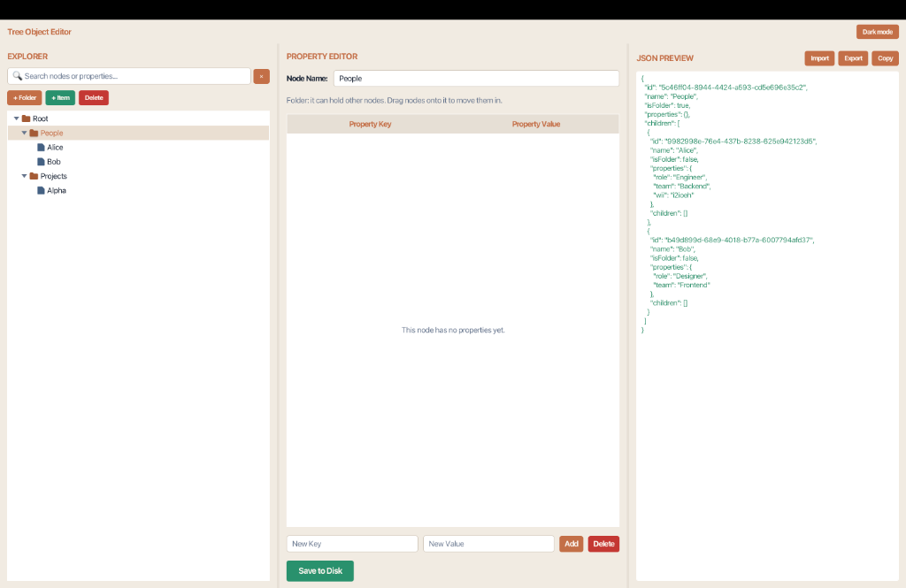
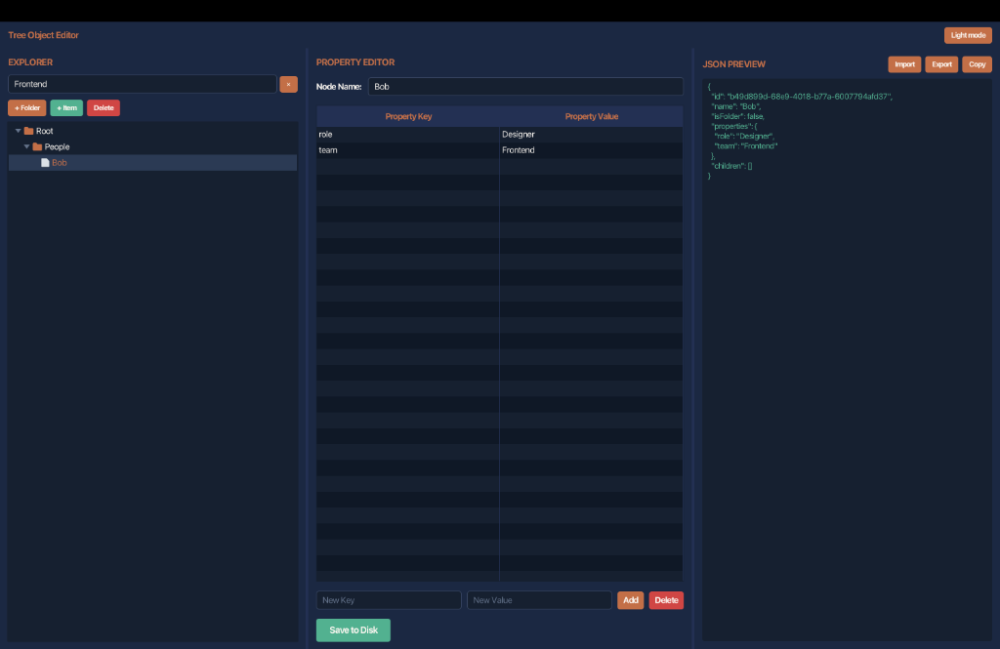
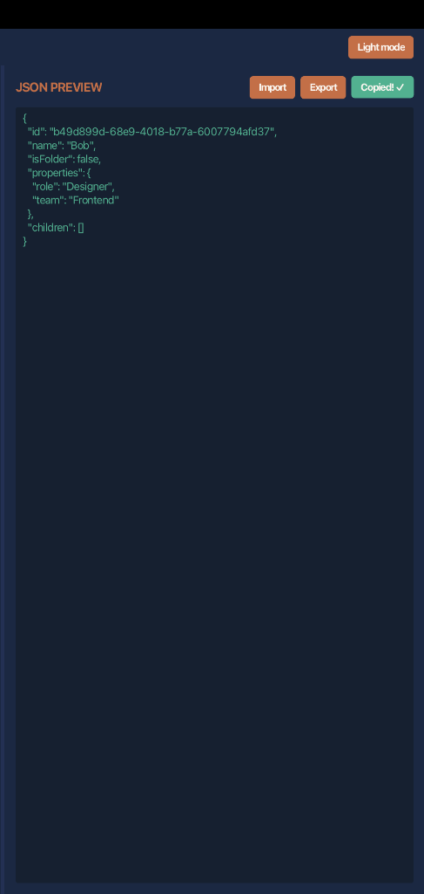

# CSC360 Group 7 — Tree Object Editor


> **Course:** CSC360 — Computer Graphics and Digital Image Processing
> **Institution:** Ahmedabad University · Monsoon Semester 2026
> **Team:** Group 7
> **Task:** Write a JavaFX program with a tree of objects, with support for editing each object.

---

## Overview

The Tree Object Editor is a JavaFX desktop application for building, browsing, and editing tree-structured data. Every node is either a **Folder** (which can hold other nodes) or an **Item** (a leaf). Both carry a name and any number of key-value properties. The entire tree is shown as JSON in real time, can be exported to disk, and is saved automatically after every change.

The window has three panels, plus a status bar across the bottom:

| Panel | What it does |
|:------|:-------------|
| **Explorer** (left) | Search, filter, add, rename, duplicate, delete, expand/collapse, and drag nodes around. |
| **Property Editor** (centre) | Edit the selected node's name and its key-value properties. |
| **JSON Preview** (right) | Shows the selected node and everything under it as JSON. Copy, import, or export it. |
| **Status bar** (bottom) | Live counts of total nodes, folders and items, and when the tree was last saved. |

---

## Screenshots

| Dark Theme | Light Theme |
|:----------:|:-----------:|
|  |  |

| Search Active | Copy Feedback |
|:-------------:|:-------------:|
|  |  |

---

## Features

| Feature | What it does |
|:--------|:-------------|
| **Real-time search** | The search box filters nodes by name or by any property key/value as you type, and auto-expands folders so matches stay visible. Click **✕** to clear. |
| **Drag and drop** | Drag a node onto a folder to move it inside, or onto the top/bottom edge of a row to reorder. Drops that would break the tree are blocked: root, self, and cycle drops are all rejected. |
| **JSON import and export** | Export the selected node (and everything under it) to a `.json` file, or import a `.json` file and choose to replace the whole tree or insert it as a new child. |
| **Expand / Collapse** | Toolbar buttons and right-click menu items to expand or collapse every folder at once. |
| **Right-click menu** | New Folder, New Item, Rename, Duplicate, Delete, Expand All, Collapse All. |
| **Light and dark theme** | Toggle with the button in the top-right corner or `Ctrl+T`. The app remembers your choice. |
| **Live editing** | Name and property changes go straight into the node as you type — switching to another node never loses work. |
| **Live status bar** | Shows the total node, folder, and item counts, and confirms the last save time. |
| **Animated copy feedback** | The Copy button briefly shows "Copied! ✓". |
| **Safe delete** | Asks for confirmation and tells you how many child nodes will also be removed. |
| **Auto-save** | Every change is written to `~/tree_data.ser` immediately. |
| **Input validation** | Duplicate property keys and blank names are rejected. |
| **Keyboard shortcuts** | `F2` rename, `Delete` delete, `Ctrl+T` theme. |

---

## Getting Started

### Prerequisites

| Tool | Minimum version | Check |
|:-----|:----------------|:------|
| JDK | 17 | `java -version` |
| Apache Maven | 3.6 | `mvn -version` |

### Run

```bash
git clone https://github.com/YugBangoriya/CSC360-Group7.git
cd CSC360-Group7
mvn clean javafx:run
```

The first run downloads the JavaFX runtime — it needs an internet connection and takes about a minute.

> **`mvnw.cmd` note:** the wrapper is in the repo but only uses a bundled Maven if `tools\maven\` is present locally — that folder is not committed. On a fresh clone it falls back to your system `mvn`. Install Maven and use `mvn` directly as above.

> **VS Code:** install the *Extension Pack for Java*, open the project folder, then run `mvn clean javafx:run` in the integrated terminal (`` Ctrl+` ``). The green Run button can fail with a "JavaFX runtime components are missing" error; the Maven command above always works.

---

## How to Use It

**Search nodes**
- Type in the search box above the Explorer to filter by name or property key/value in real time. Click **✕** to clear.

**Add nodes**
1. Select a folder in the Explorer (or an item to add next to it).
2. Click **+ Folder** or **+ Item**, or right-click → **New Folder** / **New Item**.
3. Type a name and press OK.

**Edit a node**
1. Click the node in the Explorer.
2. Change the name in **Node Name**.
3. To add a property — type a key and value at the bottom and click **Add** (or press `Enter`).
4. To edit a property — double-click its key or value in the table, type, and press `Enter`.
5. To remove a property — select its row and click **Delete** in the Property Editor.

**Move nodes**
- Drag a node onto a folder to put it inside.
- Drag it to the top or bottom edge of a row to place it just above or below that row.

**Import / export JSON**
- Select a node, then click **Export** in the JSON Preview header to save it (and everything under it) as a `.json` file.
- Click **Import**, choose a `.json` file, then pick **Replace Entire Tree** or **Add as Child Node**.
- A sample file is at `docs/sample-data/acme-tech.json` — a 25-node company tree for trying out every feature.

**Expand / collapse**
- Use the toolbar's **Expand** / **Collapse** buttons, or the right-click menu's **Expand All** / **Collapse All**, to open or close every folder at once.

**Other**
- **Rename:** select a node and press `F2`, or right-click → **Rename**.
- **Duplicate:** right-click a node → **Duplicate**. The copy is named "... (copy)" and gets its own UUID, properties, and children.
- **Delete:** select a node and press `Delete`, or click **Delete** in the Explorer toolbar.
- **Copy JSON:** click **Copy** above the JSON Preview; it briefly shows "Copied! ✓".
- **Status bar:** check the bottom of the window for live node/folder/item counts and the last save time.

Your data is stored at `~/tree_data.ser`. Delete that file to reset to the default tree.

---

## Project Structure

The project follows a Model-View-Controller layout. Source files sit directly under `src/main/` with no extra package subdirectory.

```
CSC360-Group7/
├── pom.xml
├── README.md
├── mvnw.cmd                             ← falls back to system mvn on a fresh clone
├── docs/
│   ├── README.md                        ← guide to the docs/ folder
│   ├── sample-data/
│   │   └── acme-tech.json               ← 25-node sample company tree, for Import testing
│   └── screenshots/                     ← dark, light, search, and copy-feedback shots
└── src/main/
    ├── Main.java                        ← plain launcher (avoids the JavaFX module-path error)
    ├── App.java                         ← window, top bar, and theme button
    ├── controller/
    │   └── MainController.java          ← connects panels to data; every tree change happens here
    ├── model/
    │   ├── TreeNode.java                ← one node: id, name, folder flag, children, properties
    │   └── PropertyEntry.java           ← one row of the property table
    ├── view/
    │   ├── ExplorerPanel.java           ← tree, search bar, toolbar, right-click menu, drag and drop
    │   ├── PropertyEditorPanel.java     ← name field and editable key-value TableView
    │   └── JsonPreviewPanel.java        ← JSON view with Copy, Import, and Export
    ├── util/
    │   ├── PersistenceUtil.java         ← saves and loads ~/tree_data.ser; builds the default tree
    │   ├── JsonFormatter.java           ← turns a TreeNode into JSON text
    │   ├── JsonParser.java              ← parses JSON files back into TreeNode objects
    │   └── ThemeManager.java            ← switches and remembers the theme
    └── resources/styles/
        ├── dark-theme.css
        └── light-theme.css
```

### How the pieces fit together

- **Model** (`TreeNode`, `PropertyEntry`) holds the data and knows nothing about the screen.
- **Views** (`ExplorerPanel`, `PropertyEditorPanel`, `JsonPreviewPanel`) draw the UI and report what the user did.
- **Controller** (`MainController`) receives those reports, updates the model, refreshes the status bar, and saves.
- **Styling** lives in the two CSS files. Both define the same class names — switching theme only swaps the active stylesheet.

For full architecture diagrams, per-file code explanations, and course concept mappings → **[see the Project Wiki](../../wiki)**

---

## Known Limitations

- `tree_data.ser` uses Java serialisation — not human-readable, and it will break if `TreeNode` fields change between versions. Delete the file to reset.
- No undo / redo.
- Drag-and-drop works within the tree only; you cannot drag between panels.
- The five Explorer toolbar buttons (`+ Folder`, `+ Item`, `Delete`, `Expand`, `Collapse`) can get visually truncated at smaller window widths — widen the window if this happens.

---

## License & Attribution

This is a course project for **CSC360 — Computer Graphics and Digital Image Processing** at Ahmedabad University (Monsoon 2026), built under the Project-Based Learning framework.

**Faculty:** Susanta Tewari · **Team:** CSC360 Group 7
